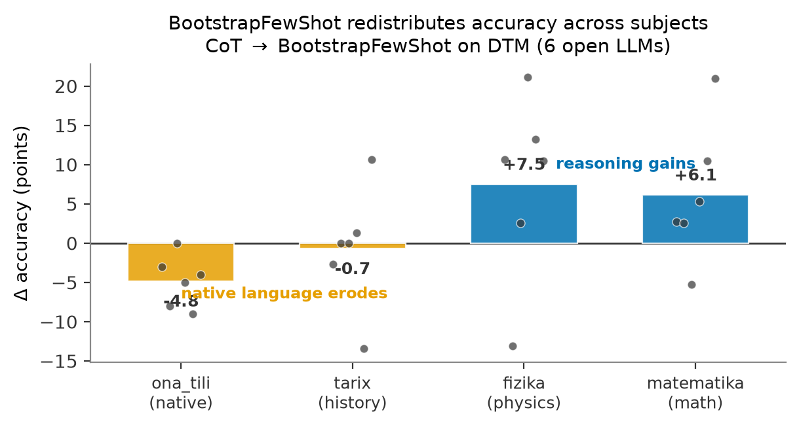

# The Hidden Native-Language Cost of Prompt Optimization in Low-Resource LLMs

Code and results for the paper. We show that DSPy's `BootstrapFewShot` produces a
small but statistically significant erosion of native-language (Uzbek grammar,
`ona_tili`) accuracy that is hidden by aggregate accuracy, and a controlled experiment
rules out demonstration subject-skew as the cause.

The benchmark (DTM, 1,000 Uzbek university-entrance MCQs) is released separately on IEEE
Dataport: **[10.21227/e4h4-kp42](https://dx.doi.org/10.21227/e4h4-kp42)**. This repo
loads it and reproduces every number in the paper.

## Paper

The paper source and compiled PDF live in [`paper/`](paper/) — read
**[`paper/main.pdf`](paper/main.pdf)**.



*Change in accuracy from CoT to DSPy `BootstrapFewShot`, per DTM subject, across the six
open LLMs. The native-language subject (`ona_tili`) erodes (mean −4.8) while the
reasoning subjects gain (+6–7). Points are per-model; regenerate with
[`paper/figures/make_delta_figure.py`](paper/figures/make_delta_figure.py).*

## Key results (revised by the E1–E6 mechanism study; see `docs/results/2026-e1-e6-dossier.md`)

| Finding | Where | Evidence |
|---|---|---|
| The original erosion (`p=0.011`, deployment-scored) is partly format failures; clean-item `p=0.073`, and it does not replicate across serving stacks | E1 + shipped traces | `analysis/decompose.py`; parse-fail flips 9/29 net |
| The format/truncation tax is **causal in the decoding budget** | E2 | e4b truncations 28→0 across 256→2048, trend `p<1e-4` |
| Demo *subject* null replicates; demo *length* null in the mild regime; harm needs the extreme-payload × tight-budget corner | E3 | paired exact McNemar, Holm |
| **No knowledge-side erosion** under within-subject bootstrapping (primary endpoint, n=3,822 pairs) — overturns the original vLLM −7.2 claim | E4 | benchmark half `p=0.036` (uncorrected) improvement; replication exact null |
| One-line fix (compliance-enforcing metric + rescue parsing) recovers 85.6% of the erosion, keeps 108% of math gains | E5 | `analysis/fixes_table.py`, pre-registered bar PASSED |
| Not a quantization artifact: erosion appears at bf16 in 2/3 large models — and every model's delta flips sign across precision | E6 | bf16 vs Q4 per-model |

## Setup

```bash
python -m venv .venv && source .venv/bin/activate
pip install -r requirements.txt
# Serve models locally with Ollama (https://ollama.com), e.g.:
ollama serve &
ollama pull qwen3.5:9b     # and the other models in the paper
# Place the DTM benchmark JSON at data/DTM_benchmark.json (see data/README.md).
```

## Reproduce the paper

Every number below regenerates from logs already committed under `results/`.

### Paper-era numbers (original submission, from shipped results)

```bash
python analysis/erosion_table.py results/main        # Table 1 (deltas)
python analysis/mcnemar.py       results/main        # Table 1 (significance, p=0.011)
python analysis/demo_dist.py     results/main        # Table 2 (2.3x skew)
python analysis/causal_stats.py  results/controlled   # Table 3 (the null)
python analysis/onatili_table.py results/onatili_vllm # Robustness (vLLM, 9B p=0.045)
```

### Mechanism-study numbers (E1-E6, from committed logs -- no GPU needed)

See `docs/results/2026-e1-e6-dossier.md` for the full write-up.

```bash
python analysis/decompose.py      results/e1                        # E1 decomposition + ladder
python analysis/dose_response.py  results/e2                        # E2 budget causal trend
python analysis/demolab_stats.py  results/e3                        # E3 demo length x subject
python analysis/residual_stats.py results/e4                        # E4 powered residual (primary endpoint)
python analysis/fixes_table.py                                      # E5 fixes shoot-out
python analysis/fertility.py      results/e1 results/e4 results/e6  # empirical token fertility
python analysis/paper_numbers.py                                    # export every number above
                                                                     # to results/paper_numbers.json
```

### Fresh experiment runs (optional -- needs a GPU box serving Ollama/vLLM)

```bash
scripts/run_e1.sh          # E1: 6 models x {direct,cot,bootstrap,bootstrap_compliant}
scripts/run_e2.sh          # E2: budget sweep (256/1024/2048; the 512 cell is E1's)
scripts/run_e3.sh          # E3: demo length x subject
scripts/run_e4.sh          # E4: powered within-subject residual + replication set
scripts/run_e5.sh          # E5: fixes shoot-out at max_tokens=2048
scripts/run_e6_driver.sh   # E6: bf16 large-model coverage (run ON the GPU box)
```

**Warning:** `src.run`'s default `--out-dir` is `results/e1`. Invoking it directly, e.g.
`python -m src.run --model qwen3.5:9b --conditions cot,bootstrap`, **overwrites the
committed E1 evidence** unless you pass a different `--out-dir`. The `scripts/run_e*.sh`
wrappers above always pass an explicit `--out-dir`; if you call `src.run`, `src.controlled`,
`src.demolab`, or `src.residual` directly, always do the same (e.g. `--out-dir
results/scratch`) so you never clobber shipped results.

## Layout

```
paper/      main.tex · references.bib · main.pdf · figures/ (figure + generators)
src/        data.py · program.py · run.py · instrument.py · demolab.py · residual.py ·
            stats.py · controlled.py · onatili_vllm.py
analysis/   erosion_table.py · demo_dist.py · mcnemar.py · causal_stats.py ·
            onatili_table.py (paper-era) · decompose.py · dose_response.py ·
            demolab_stats.py · residual_stats.py · fixes_table.py · fertility.py ·
            paper_numbers.py (E1-E6 mechanism study)
scripts/    run_e1.sh .. run_e6_driver.sh (experiment drivers) · sync_to_spark.sh ·
            sync_results_back.sh · spark_setup.sh · smoke_instrument.py
tests/      pytest suite -- `.venv/bin/python -m pytest -q`
results/    main/ · controlled/ · onatili_vllm/ · precision/ (paper-era) ·
            e1/ .. e6/ (mechanism study: per-item logs + DECISION.md) ·
            paper_numbers.json (every number above, machine-readable)
data/       README.md (DTM Dataport pointer + public replication CSV)
docs/       results/2026-e1-e6-dossier.md (E1-E6 results dossier)
```

## Citation

```bibtex
@misc{dtm2026,
  title={Uzbek Multiple-Choice Question Dataset for Large Language Model Evaluation},
  author={Hazratov, Mardon and Mansuraliyev, Husanboy and Asadov, Dovud and
          Kayumov, Abduaziz and Toshnazarov, Qobiljon},
  year={2026}, publisher={IEEE Dataport}, doi={10.21227/e4h4-kp42}}
```

The paper citation will be added on release.

## License

Code released under the MIT License. The DTM benchmark is distributed under its IEEE
Dataport terms.
